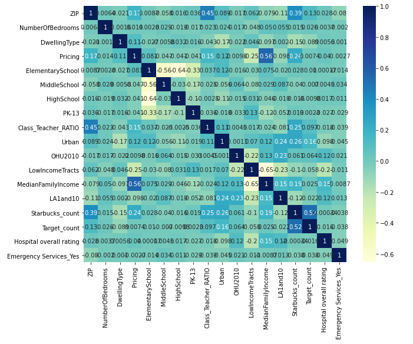
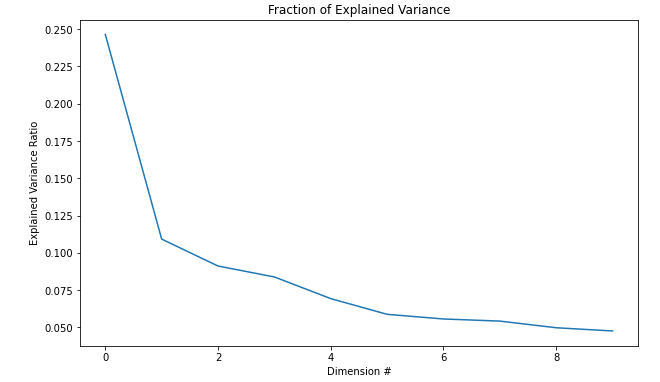
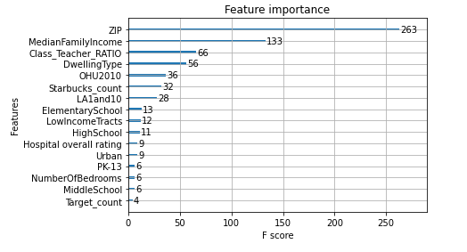
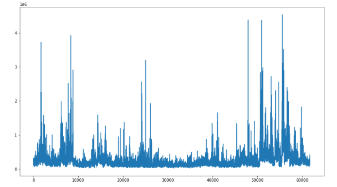
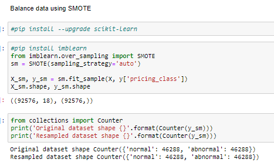
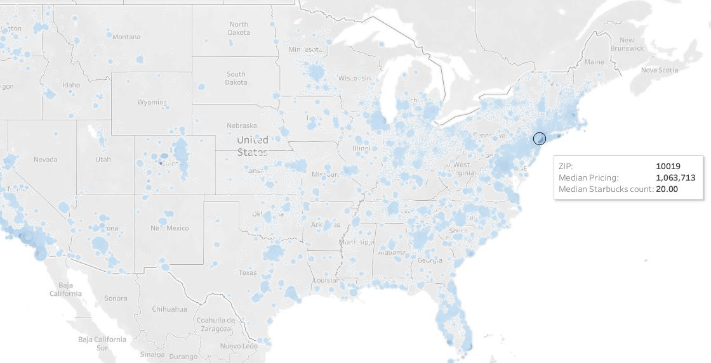
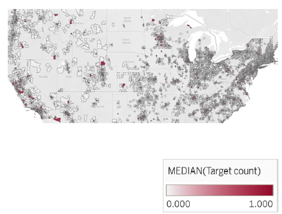
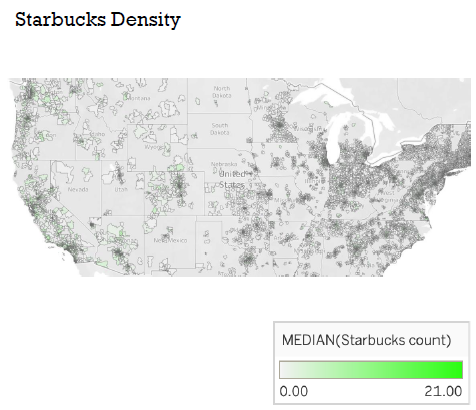
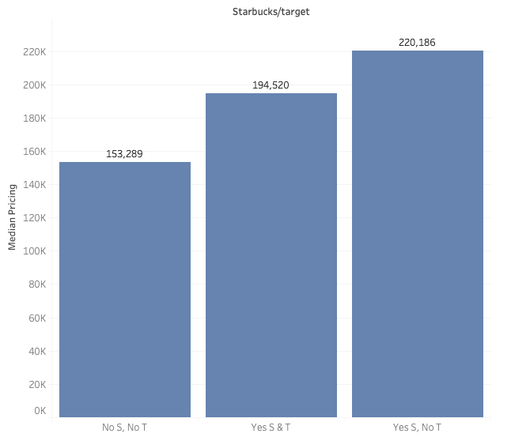

# REAL ESTATE PRICING PREDICTIONS
Elio Aybar, Cristal Garcia, Sunny Li, and Matt Norgren)  

## TABLE OF CONTENT:
- [PROBLEM STATEMENT](#problem-statement)
- [PROJECT DEFINITION OF VARIABLES](#project-definition-of-variables)
- [FEATURES & TARGET VARIABLE](#features--target-variable)
- [LIMITATIONS AND DELIMITATIONS OF DATA](#limitations-and-delimitations-of-data)
- [LIMITATIONS AND DELIMITATIONS OF DATA PART2](#limitations-and-delimitations-of-data-part2)
- [IS IT ALL HERE?](#is-it-all-here)
- [DATA EXPLORATION](#data-exploration)
- [HEATMAP, PCA & FEATURE IMPORTANCE](#heatmap-pca--feature-importance)
- [TARGET VARIABLE EXPLORATION](#target-variable-exploration)
- [METHODOLOGY](#methodology)
- [FRAMEWORK](#framework)
- [RESULTS](#results)
    - [MODELING RESULTS](#modeling-results)
    - [MODELING RESULTS DIFFERENT FEATURES](#modeling-results-different-features)
- [XGBOOST](#xgboost)
- [FINDINGS](#findings)
- [FUTURE CONSIDERATIONS](#future-considerations)

## PROBLEM STATEMENT

#### GOAL: 
PREDICT MEDIAN HOUSE PRICES GIVEN CONVENTIONAL ATTRIBUTES AND PRESENCE OF A TARGET AND/OR STARBUCKS

#### VALUE:
TESTING NONCONVENTIONAL FEATURES TO SEE IF WORTH EXPLORING IN THE FUTURE

#### HYPOTHESIS:
DIFFERENT TYPES OF NEIGHBORHOODS MAY ATTRACT SPECIFIC BUSINESSES. 

## PROJECT DEFINITION OF VARIABLES

| PROJECT | VARIABLE|
|---------|---------|
|Zillow Real Estate: | 4.3M X 75| 
|Starbucks location| 25K X 7|
|Target Locations:| 1.8K X 47|
|USA Public Schools data:| 47K X 33|
|Food Desert & Economic Data: |73K X 148|
|Hospital Ratings: |4.8K X 28|

## FEATURES & TARGET VARIABLE

|  |  |
|--|--|
|Zip code (Key)||
|Zillow|• NumberOfBedrooms  • Dwelling Type|
|School|• LEVEL_: Grade level • Class_Teacher_RATIO:|
|Food Desert/Economic Data|•Urban Indicator • Occupied Unit Housing Count (2010 Census) • Low Income Indicator • Median Family Income • Food Desert Indicator |
|Hospital|• Hospital Rating •Emergency Services Flag|
|Starbucks Locations||
|Target Locations||
|Pricing||

## LIMITATIONS AND DELIMITATIONS OF DATA

#### 01. Hospital: hospital deserts distance between hospital and home)
#### 02. Public School Data: Creating Student to Teacher Ratio
#### 03. Food Desert Data: converting CensusTract number to Zipcode
#### 04. Starbucks and Target

## LIMITATIONS AND DELIMITATIONS OF DATA PART2

|  | |
|-|-|
|Granularity ||
|Time | (1996 – 2017)|
|Features | • Sales Data    • Zillow Estimates |
|Complexity of combination | 19K Unique Zip codes|
|Aggregation of Features | • Number of Bedrooms   • Dwelling Type |

## IS IT ALL HERE?

- Scarcity of price
- Duplicative feature types
- Scaling & Aggregation
- Consolidated variable creation
    - Function creation
    - Factorization
- Melting and Reshaping

## DATA EXPLORATION
#### Featurization:
- 90% time spent feature engineering (5.5 weeks)
- Individually worked on datasets separately:
  - Identified and removed features with high collinearity
  - Captured summary statistics
- Consolidated features and visualized relationship

## HEATMAP, PCA & FEATURE IMPORTANCE

## TARGET VARIABLE EXPLORATION

## METHODOLOGY
- Models
    - Linear Regression
    - Decision Tree
    - Random Forest
    - Support Vector Regression
    - Gradient Boosting
    - KNN for Regression
    - XGBoost

## FRAMEWORK
#### 1. Validation Methodology
- Compare Desired Errors with Training and Cross Validation errors

#### 2. Descriptions
- Choose top 3 models

#### 3. Model Selection Justification
- Best performing RMSE

## RESULTS
### MODELING RESULTS
- Linear Regression
    - Desired Error: 279471.46
    - Training Error: 0.78
    - Cross Validation Error: 0.78
- Support Vector Regression (SVR)
    - RMSE score: 0.65
- Decision Tree
    - Hyperparameter Tuning: max depth = 4, min_samples_leaf = 0.1
    - Desired Error: 210381.81
    - Training Error: 194304.60
    - Cross Validation Error: 195936.04
- Random Forest
    - Hyperparameter Tuning: max depth = 4, min_samples_leaf = 0.1
    - Desired Error: 204785.74
    - Training Error: 201373.10
- Gradient Boosting
    - RMSE: 131471.88186
- KNN for Regression
    - N_neighbors = 2, RMSE value for k = 2 of 325245.033
- **XGBoost**
    - **RMSE = 108618**

### MODELING RESULTS DIFFERENT FEATURES
- Linear Regression
  - Desired Error: 294214.72
  - Training Error: 0.84
  - Cross Validation Error: 0.84
- Support Vector Regression (SVR)
  - RMSE score: 0.79
- Decision Tree
  - Hyperparameter Tuning: max depth = 4, min_samples_leaf = 0.1
  - Desired Error: 204245.67
  - Training Error: 200400.99
  - Cross Validation Error: 200487.57
- Random Forest
  - Hyperparameter Tuning: max depth = 4, min_samples_leaf = 0.1
  - Desired Error: 208813.27
  - Training Error: 205483.11
- Gradient Boosting
  - RMSE: 173276.42
- KNN for Regression
  - N_neighbors = 2, RMSE value for k = 2 of 327642.71
- **XGBoost**
  - **RMSE = 112413**

## XGBOOST
#### eXtreme Gradient Boosted trees
#### Most powerful machine learning algorithm up until today
#### Features:
- Regularized boosting ( prevent overfitting)
- Can handle missing values
- Parallel processing
- Can cross validation at each iteration

## FINDINGS

### Target Density

### Starbucks Density

### Starbucks Influence

## CONCLUSIONS
- Non-conventional features may be economic indicators.
- We spent 80% of time on addressing a number of issues around data quality, standards, access.
- We have plans for model optimization but didn’t have time to achieve it.

## FUTURE CONSIDERATIONS 
- New dataset or extension of features
- Number of bathrooms, rent cost, Square footage, etc.
- Dollar trees stores, Dunkin donuts, pharmacies, supermarkets, etc
- Complex imputation methods
    - Focus on the hospital specifically, calculate the radii of hospitals, then use radii to weigh the hospital rating for each zip code.
- Robust test
    - Replacing zip code with county/city
- Include time series data to the analysis